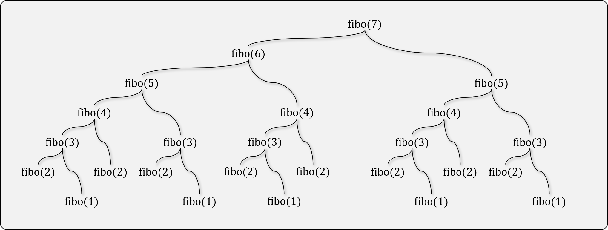

# 동적 계획법 (Dynamic Programming; DP)

## 동적계획법이란



- 복잡한 문제를 보다 단순한 부분 문제(Sub-Problems)로 재귀적으로 나누어 해결하는 방법
- 두 가지 조건을 만족해야만 동적프로그래밍이라고 할 수 있다.
  - Optimal Substructure: 부분 문제들의 최적해가 전체의 최적해를 이루어야 한다.
  - Overlapping Sub-Problems: 동일한 부분 문제가 여러번 발생해야 한다.
    - 이 조건이 만족되지 않으면 분할정복(Divide & Conquer) 문제라고 한다.
- 중복되는 연산을 미리 캐싱해 두고, 중복 연산이 발생할 때 마다 참조하여 연산을 줄인다. (Memoization)
  - **Array**를 이용하여 저장할 수도 있고, **Hash Table**을 이용할 수도 있다.

## 동적 계획법의 종류

- Top-Down 접근법
  - 큰 문제부터 시작하여, 작은 문제로 나누는 접근법
  - 일반적으로 재귀적으로 구현(Recursion)할 때 사용된다.
- Bottom-Up 접근법
  - 문제를 미리 나누어 두고, 작은 문제의 답을 모아 큰 문제를 해결하는 접근법
  - 일반적으로 반복적으로 구현(Iteration)할 때 사용된다.

## 동적계획법의 예

### 피보나치 수열


- 피보나치 수열의 재귀적 구현 (Top-Down Approach)

```javascript
const fibo = new Map();
fibo.set(0, 0);
fibo.set(1, 1);

function fibonacci(n) {
    if (fibo.has(n)) {
      return fibo.get(n)
    }

    let res = fibonacci(n-1) + fibonacci(n-2);
    fibo.set(n, res);
    return res;
}
```

- 피보나치 수열의 반복적 구현 (Bottom-Up Approach)

```javascript
function fibonacci(n) {
    const fibo = new Array(n + 1);
    fibo.set(0, 0);
    fibo.set(1, 1);

    for (let i = 2; i < n + 1; i++) {
        fibo.set(i, fibo.get(i-1) + fibo.get(i-2));
    }
    return fibo.get(n);
}
```

## [실습] 직사각형 퍼즐 문제

- [프로그래머스 직사각형 퍼즐 문제](https://programmers.co.kr/learn/courses/30/lessons/12900)

## [실습] 도둑질 문제

- [프로그래머스 도둑질 문제](https://programmers.co.kr/learn/courses/30/lessons/42897)
